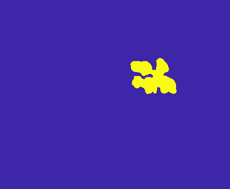
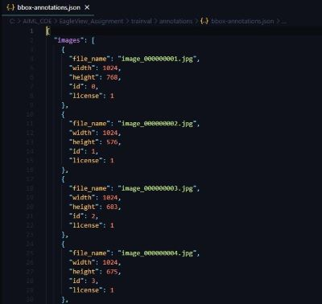

# Grayscale to COCO annotation

**This tool converts grayscale image labels into COCO object detection annotations.** These annotations can be used to train many of the common object detection machine learning models, such as pytorch vision, meta detectron2 and google tensorflow.

The tool takes in your images and corresponding grayscale labels, and outputs a COCO object detection segmentation json. It uses openCV to convert grayscale image labels to pixel segmentations and bounding boxes, and packages the output into the official COCO segmentation JSON format. The output COCO json can be fed directly into any object detection model which accepts COCO data.

*Note - you will need to categorise the objects in the image after the tool has generated the json, if you have more than one category of object in your dataset*

&nbsp;&nbsp;&nbsp;&nbsp;&nbsp;&nbsp;&nbsp;&nbsp;&nbsp;


## Requirements
`Python3`
`openCV`
IMAGE & LABEL FILE MUST HAVE SAME NAME OR IMAGE, IMAGE_label

## Installation
```git clone REPOURL.GIT```

## Usage

```coco-generator.py -i PATH-TO-IMAGES-FOLDER -a PATH-TO-LABELS-FOLDER```

### optional arguments
-o PATH		output file path

-ic			set 'iscrowd' default to true

## Example
```coco-generator.py -i data/images/train/ -a data/images/```