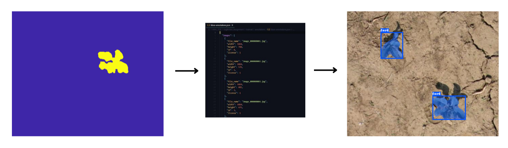

# Grayscale to COCO annotation

**This tool converts grayscale image labels into COCO object detection annotations.** These annotations can be used to train many of the common object detection machine learning models, such as pytorch vision, meta's detectron2 and google tensorflow.

The tool takes in your images and corresponding grayscale labels, and outputs a COCO object detection segmentation json. It uses openCV to convert grayscale image labels to pixel segmentations and bounding boxes, and packages the output into the official COCO segmentation JSON format. **The output COCO json can be fed directly into any object detection model which accepts COCO data.**




*Example data from the open-source Growliflower dataset https://rs.ipb.uni-bonn.de/data/growliflower/*


## Requirements
`python3`
`openCV`

## Installation
```git clone https://github.com/CHANFRAN-LABS/coco-generator.git```

## Data Preparation

1. Organise your data into two folders, one for the images and another for the corresponding grayscale labels. Important: each image and corresponding label must have the same filename - see the example-data folder.

2. Fill in the category and license information in coco-template.json.

3. After you have run the tool, you will need to edit the output json to assign category IDs to each of your annotations. You can also edit any other metadata manually at this stage (e.g. assign iscrowd values of 1 if some of your objects represent crowds of smaller objects)

## Usage

```
usage: coco-generator.py [-h] [-i PATH] [-a PATH] [-o PATH] [-c CATEGORY_ID] [-l LICENSE_ID]

Generate COCO json dataset from grayscale object labels

options:
  -h, --help            show this help message and exit
  -i PATH, --images PATH
                        path to images folder
  -a PATH, --annotations PATH
                        path to annotations json file
  -o PATH, --output PATH
                        output coco json filename | defaults to coco-dataset
  -c CATEGORY_ID, --category_id CATEGORY_ID
                        default category id for objects in your dataset. If you have more than one category, you need to enter the rest manually in the output json | defaults
                        to 1
  -l LICENSE_ID, --license_id LICENSE_ID
                        default license id for your images. If you have more than one license, you need to enter the rest manually in the output json | defaults to 4
```

## Example
```coco-generator.py -i example-data/images/ -a example-data/labels/```

## Tips

- This coco-viewer tool is useful for checking your annotations match up with your images https://github.com/trsvchn/coco-viewer/tree/main?tab=readme-ov-file